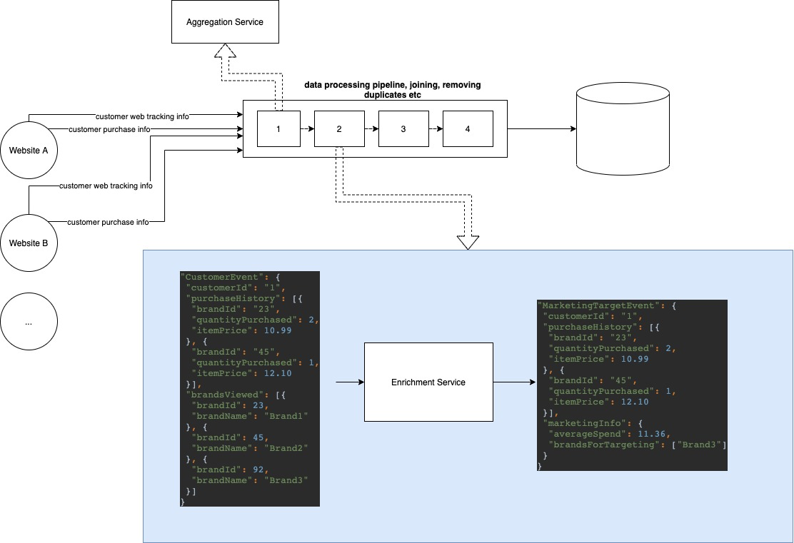

# data-eng.technical-task.enrichment-service

### Overview of problem:

We manage a data pipeline which consists of various services performing operations on data we receive from several Websites. The data spans:
1. Customer web tracking information (`brandsViewed`) relating to brands and other content that a customer has viewed.
2. Customer purchase information (`purchaseHistory`)

This data is typically sent to us as separate events, and as a first step in the pipeline we will aggregate these events and output what we refer to as a `CustomerEvent` - which is an aggregation of both web and purchase information tracking.

For the purpose of this exercise, we want you to implement some changes as part of an Enrichment Service, which will perform operations on this aggregated data. See the below diagram for reference.



### Example input JSON:
```
"CustomerEvent": {
	"customerId": "1",
	"purchaseHistory": [{
		"brandId": "23",
		"quantityPurchased": 2,
		"itemPrice": 10.99
	}, {
		"brandId": "45",
		"quantityPurchased": 1,
		"itemPrice": 12.10
	}],
	"brandsViewed": [{
		"brandId": 23,
		"brandName": "Brand1"
	}, {
		"brandId": 45,
		"brandName": "Brand2"
	}, {
		"brandId": 92,
		"brandName": "Brand3"
	}]
}
```

The above structure has been replicated in the `CustomerEvent` object. You are not required to worry about JSON as part of this exercise; the above is an example of the kind of input we can expect.
The aim of this exercise is to perform some calculations on the input dataset and output the `MarketingTargetEvent` object.

### Example output JSON:

```
"MarketingTargetEvent": {
	"customerId": "1",
	"purchaseHistory": [{
		"brandId": "23",
		"quantityPurchased": 2,
		"itemPrice": 10.99
	}, {
		"brandId": "45",
		"quantityPurchased": 1,
		"itemPrice": 12.10
	}],
	"marketingInfo": {
		"averageSpend": 11.36,
		"brandsForTargeting": ["Brand3"]
	}
}
```

## Technical requirements

You are required to implement the below two methods found in the `TransformerUtils.class` file.
A basic test has been provided in the `src/test/java/com/comparethemarket/enrichment/TransformerTest.java` file.

### 1. averageSpend
This should be the total amount the customer has spent across all purchases, divided by the total quantity of products purchased.

### 2. brandsForTargeting
You can consider the requirement here to be a list of brands seen but not purchased, required by downstream consumers for the purpose of targeted marketing. Here we are interested in the brandNames field, where the customer has viewed a particular brand (see BrandsViewed), but has not purchased it.

## Additional information

1. You are welcome to use Google if necessary, please do ensure you can share your screen while doing so.
2. A basic test and associated stub is provided which can be used to test against your output.
    1. `src/test/java/com/comparethemarket/enrichment/TransformerTest.java`
    2. `src/test/java/com/comparethemarket/enrichment/stubs/CustomerEventStub.java`
    3. `src/test/java/com/comparethemarket/enrichment/TransformerUtilsTest.java` can be used for testing the methods in TransformerUtils. A placeholder is provided to adjust as necessary.
